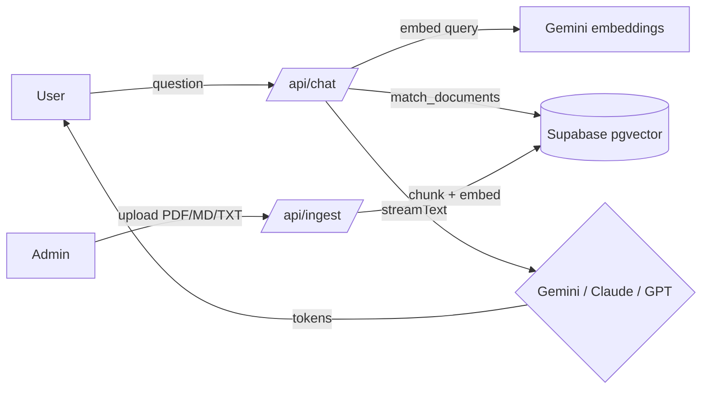

# ask-me-rag

A streaming RAG chatbot to ask about me.

## Screenshots


<!-- Please add a real screenshot of the chat interface here after deployment. -->

## Features

- **Streaming chat** — Real-time token streaming for responsive user experience
- **Switchable LLM providers** — Choose between Gemini (Google), Claude (Anthropic), and GPT (OpenAI) on the fly
- **Free to run** — Defaults to Google Gemini for both chat and embeddings, so a single free Google AI Studio key runs the whole app at no cost
- **RAG over personal documents** — Query answers from ingested PDFs, Markdown, and text files
- **Admin-protected upload** — Securely manage knowledge base with header authentication
- **Multilingual support** — PT/EN language toggle within the chat
- **Vector search** — Fast semantic retrieval via Supabase pgvector

## Architecture



**Data flow:**

1. **User query** → `/api/chat` receives question
2. **Embeddings** → Query is embedded using Google `gemini-embedding-001` (1536 dims)
3. **Vector search** → Supabase pgvector retrieves matching documents
4. **LLM stream** → System prompt with context + user message is streamed to Gemini, Claude, or GPT
5. **Admin upload** → `/api/ingest` chunks documents, embeds, and stores in Supabase

## Setup

### Prerequisites

- Node.js 18+
- Supabase account with a PostgreSQL database
- A free Google AI Studio API key (used for embeddings, and for chat by default) — get one at [aistudio.google.com/apikey](https://aistudio.google.com/apikey)
- Optionally, an Anthropic or OpenAI key if you want to switch the chat provider

### Steps

1. **Clone the repository:**
   ```bash
   git clone <repo-url>
   cd llm-next-chat
   ```

2. **Install dependencies:**
   ```bash
   npm install
   ```

3. **Set up environment variables:**
   ```bash
   cp .env.example .env.local
   # Edit .env.local with your API keys and Supabase URL
   ```

4. **Initialize the database:**
   - Log in to your Supabase project
   - Open the SQL Editor
   - Copy and paste the contents of `supabase/schema.sql`
   - Click "Run"

5. **Start the development server:**
   ```bash
   npm run dev
   ```

   Open [http://localhost:3000](http://localhost:3000) in your browser.

## Environment Variables

| Variable | Purpose | Example |
|----------|---------|---------|
| `LLM_PROVIDER` | Which chat LLM to use: `google`, `anthropic`, or `openai` | `google` |
| `GOOGLE_GENERATIVE_AI_API_KEY` | Google AI Studio key — **always required**: used for embeddings (RAG) regardless of chat provider; also the chat model when `LLM_PROVIDER=google` | (always required) |
| `GOOGLE_MODEL` | Gemini chat model identifier | `gemini-2.5-flash` |
| `ANTHROPIC_API_KEY` | API key for Anthropic Claude | (only if `LLM_PROVIDER=anthropic`) |
| `ANTHROPIC_MODEL` | Claude model identifier | `claude-sonnet-4-6` |
| `OPENAI_API_KEY` | API key for OpenAI | (only if `LLM_PROVIDER=openai`) |
| `OPENAI_MODEL` | OpenAI model identifier | `gpt-4o-mini` |
| `NEXT_PUBLIC_SUPABASE_URL` | Supabase project URL | `https://<project>.supabase.co` |
| `SUPABASE_SERVICE_ROLE_KEY` | Supabase service role key (server-side only) | (from Supabase settings) |
| `ADMIN_PASSWORD` | Secret token for `/admin` upload endpoint (header: `x-admin-token`) | (set a strong value) |

## Switching LLM Providers

Set `LLM_PROVIDER` in `.env.local` to change the **chat** model (embeddings always use Google):

- **Google Gemini:** `LLM_PROVIDER=google` (default)
  - Model: `GOOGLE_MODEL=gemini-2.5-flash`
  - Requires `GOOGLE_GENERATIVE_AI_API_KEY` (already required for embeddings)

- **Anthropic Claude:** `LLM_PROVIDER=anthropic`
  - Model: `ANTHROPIC_MODEL=claude-sonnet-4-6`
  - Requires `ANTHROPIC_API_KEY`

- **OpenAI GPT:** `LLM_PROVIDER=openai`
  - Model: `OPENAI_MODEL=gpt-4o-mini`
  - Requires `OPENAI_API_KEY`

Restart the dev server after changing the provider.

## Scope Decisions

This project is intentionally scoped to keep complexity low:

- **Admin authentication** — Uses a single shared secret (`ADMIN_PASSWORD` header) rather than full user auth. Suitable for personal use; not production-grade multi-user.
- **Embeddings** — Always uses Google `gemini-embedding-001` (pinned to 1536 dims to match the Supabase schema), independent of the chat provider. Standardizing on one embedding model keeps the vector store consistent; switching embedding models later requires re-ingesting all documents.
- **Shared knowledge base** — All users query the same document store. No per-visitor isolation or personalization. Suitable for a single knowledge base about the project owner.
- **No persistent chat history** — Messages are not stored. Each session is stateless. Conversation context is only in the current browser session.

## Tech Stack

- **Framework:** Next.js 16 (App Router)
- **Language:** TypeScript
- **Styling:** Tailwind CSS v4 (CSS-based, no `tailwind.config.js`)
- **UI Components:** Radix UI
- **Animations:** Motion
- **LLM Integration:** Vercel AI SDK v6
- **Vector Database:** Supabase (PostgreSQL + pgvector)
- **Document Parsing:** unpdf
- **Embeddings:** Google `gemini-embedding-001` (1536 dims)

## Running Tests and Build

```bash
# Run unit tests
npm run test

# Build for production
npm run build

# Start production server
npm start
```

## License

MIT
