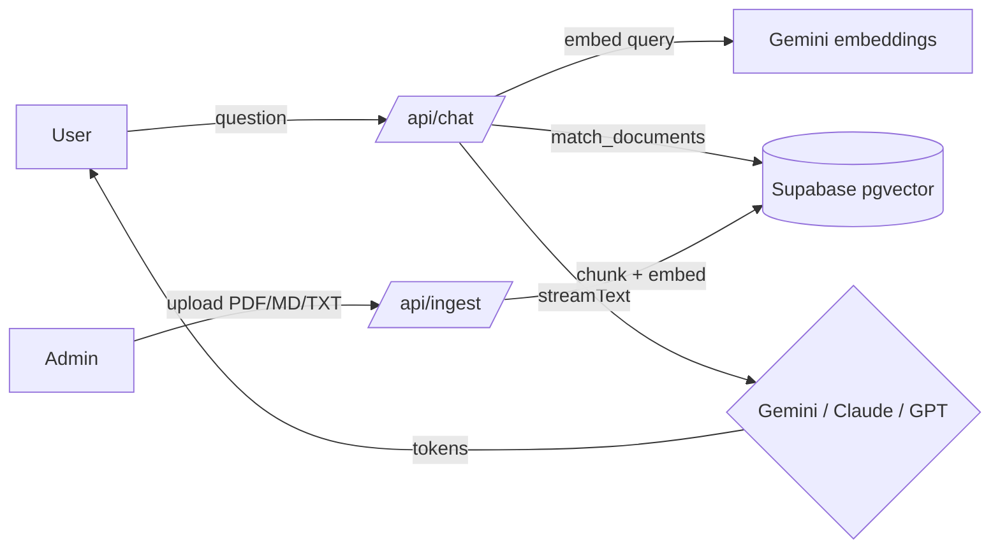

# ask-me-rag

A streaming RAG chatbot to ask about me.

## Screenshots


<!-- Please add a real screenshot of the chat interface here after deployment. -->

## Features

- **Streaming chat** — Real-time token streaming for responsive user experience
- **Switchable LLM providers** — Choose between Gemini (Google), Claude (Anthropic), and GPT (OpenAI) on the fly
- **Free to run** — Defaults to Google Gemini for both chat and embeddings, so a single free Google AI Studio key runs the whole app at no cost
- **RAG over personal documents** — Query answers from ingested PDFs, Markdown, and text files
- **Private ingestion workspace** — Manage sources behind an HTTP-only admin session
- **Multilingual support** — PT/EN language toggle within the chat
- **Vector search** — Fast semantic retrieval via Supabase pgvector

## Architecture



**Data flow:**

1. **User query** → `/api/chat` receives question
2. **Embeddings** → Query is embedded using Google `gemini-embedding-001` (1536 dims)
3. **Vector search** → Supabase pgvector retrieves matching documents
4. **LLM stream** → System prompt with context + user message is streamed to Gemini, Claude, or GPT
5. **Admin upload** → `/api/ingest` chunks documents, embeds, and stores in Supabase

## Setup

### Prerequisites

- Node.js 22+
- Supabase account with a PostgreSQL database
- A free Google AI Studio API key (used for embeddings, and for chat by default) — get one at [aistudio.google.com/apikey](https://aistudio.google.com/apikey)
- Optionally, an Anthropic or OpenAI key if you want to switch the chat provider

### Steps

1. **Clone the repository:**
   ```bash
   git clone <repo-url>
   cd llm-next-chat
   ```

2. **Install dependencies:**
   ```bash
   npm install
   ```

3. **Set up environment variables:**
   ```bash
   cp .env.example .env.local
   # Edit .env.local with your API keys and Supabase URL
   ```

4. **Initialize the database:**
   - Log in to your Supabase project
   - Open the SQL Editor
   - Copy and paste the contents of `supabase/schema.sql`
   - Click "Run"

5. **Apply migrations (idempotent — re-runnable):**
   - In the Supabase SQL Editor, run every file under `supabase/migrations/` in
     filename order (currently `0001_chunk_hash_backfill_and_constraint.sql` and
     `0002_enable_row_level_security.sql`).
   - `0001` backfills `chunk_hash`, dedupes legacy duplicates, adds a unique
     index on `chunk_hash` (declarative dedup), and an expression index on
     `metadata->>'source'` for fast dedup lookups.
   - `0002` enables Row Level Security on `documents` and `schema_migrations`
     with least-privilege policies, so an accidental anon-key client cannot read
     or write the knowledge base.
   - Each records itself in a `schema_migrations` table, so re-running is a no-op.

6. **Start the development server:**
   ```bash
   npm run dev
   ```

   Open [http://localhost:3000](http://localhost:3000) in your browser.

## Environment Variables

| Variable | Purpose | Example |
|----------|---------|---------|
| `LLM_PROVIDER` | Which chat LLM to use: `google`, `anthropic`, or `openai` | `google` |
| `GOOGLE_GENERATIVE_AI_API_KEY` | Google AI Studio key — **always required**: used for embeddings (RAG) regardless of chat provider; also the chat model when `LLM_PROVIDER=google` | (always required) |
| `GOOGLE_MODEL` | Gemini chat model identifier | `gemini-2.5-flash` |
| `ANTHROPIC_API_KEY` | API key for Anthropic Claude | (only if `LLM_PROVIDER=anthropic`) |
| `ANTHROPIC_MODEL` | Claude model identifier | `claude-sonnet-4-6` |
| `OPENAI_API_KEY` | API key for OpenAI | (only if `LLM_PROVIDER=openai`) |
| `OPENAI_MODEL` | OpenAI model identifier | `gpt-4o-mini` |
| `NEXT_PUBLIC_SUPABASE_URL` | Supabase project URL | `https://<project>.supabase.co` |
| `SUPABASE_SERVICE_ROLE_KEY` | Supabase service role key (server-side only) | (from Supabase settings) |
| `ADMIN_PASSWORD` | Shared secret for the admin login (`POST /api/admin/login` with JSON `{ "password" }`). Sets an HTTP-only `askme_admin_session` cookie. Must be ≥ 20 characters in production. | (set a strong value ≥ 20 chars) |
| `RAG_MATCH_THRESHOLD` | Minimum cosine similarity for vector retrieval (0 = return everything). Optional; default `0.3`. | `0.3` |

## Switching LLM Providers

Set `LLM_PROVIDER` in `.env.local` to change the **chat** model (embeddings always use Google):

- **Google Gemini:** `LLM_PROVIDER=google` (default)
  - Model: `GOOGLE_MODEL=gemini-2.5-flash`
  - Requires `GOOGLE_GENERATIVE_AI_API_KEY` (already required for embeddings)

- **Anthropic Claude:** `LLM_PROVIDER=anthropic`
  - Model: `ANTHROPIC_MODEL=claude-sonnet-4-6`
  - Requires `ANTHROPIC_API_KEY`

- **OpenAI GPT:** `LLM_PROVIDER=openai`
  - Model: `OPENAI_MODEL=gpt-4o-mini`
  - Requires `OPENAI_API_KEY`

Restart the dev server after changing the provider.

## Scope Decisions

This project is intentionally scoped to keep complexity low:

- **Admin authentication** — Uses a single shared secret (`ADMIN_PASSWORD`) validated by `POST /api/admin/login`, which sets an HTTP-only `askme_admin_session` cookie (timing-safe compare, in-memory rate limiting, ≥20-char password enforced in production). Routes under `/admin` and `/api/ingest` require this session and are additionally gated by `proxy.ts` (Next 16's middleware convention) as defense in depth. Not production-grade multi-user.
- **Embeddings** — Always uses Google `gemini-embedding-001` (pinned to 1536 dims to match the Supabase schema), independent of the chat provider. Standardizing on one embedding model keeps the vector store consistent; switching embedding models later requires re-ingesting all documents.
- **Shared knowledge base** — All users query the same document store. No per-visitor isolation or personalization. Suitable for a single knowledge base about the project owner.
- **No persistent chat history** — Messages are not stored. Each session is stateless. Conversation context is only in the current browser session.
- **Development preview** — `next dev` returns a deterministic streamed Markdown response for visual QA without calling embeddings or an LLM. Production keeps the real RAG flow.

## Tech Stack

- **Framework:** Next.js 16 (App Router)
- **Language:** TypeScript
- **Styling:** Tailwind CSS v4 (CSS-based, no `tailwind.config.js`)
- **UI Components:** Astryx Design System with the neutral theme
- **Animations:** CSS transitions using Astryx motion tokens
- **LLM Integration:** Vercel AI SDK v6
- **Vector Database:** Supabase (PostgreSQL + pgvector)
- **Document Parsing:** unpdf
- **Embeddings:** Google `gemini-embedding-001` (1536 dims)

## Running Tests and Build

```bash
# Run unit tests
npm run test

# Build for production
npm run build

# Start production server
npm start
```

## CI/CD

Pull requests to `main` must pass two required checks:

- **Quality** — installs dependencies with `npm ci`, runs ESLint, the Vitest suite, and the production build.
- **React Doctor** — scans changed React files and blocks new error-severity findings while commenting on the pull request.

After a merge, the same CI runs against `main`. A successful run can deploy the validated commit to Vercel. To enable production deployment, create a production Deploy Hook for the `main` branch under Vercel Project Settings → Git, then save its URL as this GitHub Actions secret:

- `VERCEL_DEPLOY_HOOK_URL`

Then create the repository variable `VERCEL_DEPLOY_ENABLED` with the value `true`. Until that variable is enabled, the deployment job remains safely skipped.

## Deploy (Google Cloud Run)

The production deployment runs on Cloud Run via Cloud Build ([cloudbuild.yaml](cloudbuild.yaml)). Three scripts cover the whole flow:

```bash
# 1. Push migrations to the remote Supabase project
#    (fresh database? apply supabase/schema.sql in the SQL Editor first)
bash scripts/setup-db.sh <SUPABASE_ACCESS_TOKEN>

# 2. Fill Secret Manager values (validates keys before publishing:
#    rejects the public anon key and live-tests the Google API key)
bash scripts/fill-secrets.sh

# 3. Build and deploy
gcloud builds submit --config cloudbuild.yaml

# 4. Verify everything end to end (secret values, service status, live smoke test)
bash scripts/check-deploy.sh
```

Key requirements:

- The Supabase secret must be the **service_role** key (legacy JWT) or a new-format **secret key** (`sb_secret_...`) — never the anon/publishable key. Row Level Security blocks the `anon` role, so the public key breaks every database call.
- The Google key must be an **AI Studio API key** (https://aistudio.google.com/apikey), used for both embeddings and chat.
- Cloud Run reads secrets pinned to `:latest`, so after rotating a secret run step 3 again (or redeploy the service) to pick up the new version.

## License

MIT
