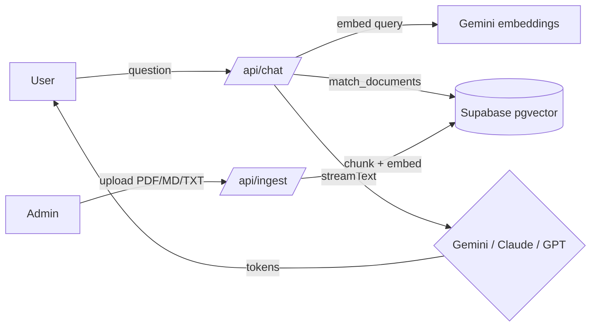

# ask-me-rag

A streaming RAG chatbot to ask about me.

## Screenshots


<!-- Please add a real screenshot of the chat interface here after deployment. -->

## Features

- **Streaming chat** — Real-time token streaming for responsive user experience
- **Switchable LLM providers** — Choose between Gemini (Google), Claude (Anthropic), and GPT (OpenAI) on the fly
- **Free to run** — Defaults to Google Gemini for both chat and embeddings, so a single free Google AI Studio key runs the whole app at no cost
- **RAG over personal documents** — Query answers from ingested PDFs, Markdown, and text files
- **Private ingestion workspace** — Manage sources behind an HTTP-only admin session
- **Multilingual support** — PT/EN language toggle within the chat
- **Vector search** — Fast semantic retrieval via Supabase pgvector

## Architecture



**Data flow:**

1. **User query** → `/api/chat` receives question
2. **Embeddings** → Query is embedded using Google `gemini-embedding-001` (1536 dims)
3. **Vector search** → Supabase pgvector retrieves matching documents
4. **LLM stream** → System prompt with context + user message is streamed to Gemini, Claude, or GPT
5. **Admin upload** → `/api/ingest` chunks documents, embeds, and stores in Supabase

## Setup

### Prerequisites

- Node.js 22+
- Docker Desktop (para banco e testes locais da observabilidade)
- Supabase account with a PostgreSQL database
- A free Google AI Studio API key (used for embeddings, and for chat by default) — get one at [aistudio.google.com/apikey](https://aistudio.google.com/apikey)
- Optionally, an Anthropic or OpenAI key if you want to switch the chat provider

### Steps

1. **Clone the repository:**
   ```bash
   git clone <repo-url>
   cd llm-next-chat
   ```

2. **Install dependencies:**
   ```bash
   npm install
   ```

3. **Set up environment variables:**
   ```bash
   cp .env.example .env.local
   # Edit .env.local with your API keys and Supabase URL
   ```

4. **Initialize the database:**
   - Para um projeto Supabase existente, aplique todas as migrações versionadas:

   ~~~bash
   SUPABASE_DB_URL='postgresql://...' bash scripts/setup-db.sh
   ~~~

   - Para um banco novo, `0000_initial_schema.sql` cria a estrutura inicial e as demais migrações evoluem o schema em ordem. Não aplique arquivos manualmente fora dessa ordem.

5. **Start the development server:**

   ~~~bash
   npm run dev
   ~~~

   Open [http://localhost:3000](http://localhost:3000) in your browser.

## Testar a observabilidade localmente

Com Docker Desktop ativo, um único comando sobe o Supabase local mínimo (Postgres, PostgREST, gateway e Auth para as credenciais locais), recria o banco com todas as migrações, executa pgTAP e lint SQL, gera chaves efêmeras e inicia a aplicação:

~~~bash
npm run observability:local
~~~

O monitor fica em [http://localhost:3000/admin/observability](http://localhost:3000/admin/observability). A senha de teste é `local-observability-admin-2026`. Em outro terminal:

~~~bash
npm run observability:smoke
~~~

O smoke valida captura, IP mascarado, dispositivo, consulta, detalhe e exclusão. Para parar os contêineres:

~~~bash
npm run observability:local:stop
~~~

Detalhes de segurança, retenção e rollout estão em [docs/chat-observability.md](docs/chat-observability.md).

## Environment Variables

| Variable | Purpose | Example |
|----------|---------|---------|
| `LLM_PROVIDER` | Which chat LLM to use: `google`, `anthropic`, or `openai` | `google` |
| `GOOGLE_GENERATIVE_AI_API_KEY` | Google AI Studio key — **always required**: used for embeddings (RAG) regardless of chat provider; also the chat model when `LLM_PROVIDER=google` | (always required) |
| `GOOGLE_MODEL` | Gemini chat model identifier | `gemini-2.5-flash` |
| `ANTHROPIC_API_KEY` | API key for Anthropic Claude | (only if `LLM_PROVIDER=anthropic`) |
| `ANTHROPIC_MODEL` | Claude model identifier | `claude-sonnet-4-6` |
| `OPENAI_API_KEY` | API key for OpenAI | (only if `LLM_PROVIDER=openai`) |
| `OPENAI_MODEL` | OpenAI model identifier | `gpt-4o-mini` |
| `NEXT_PUBLIC_SUPABASE_URL` | Supabase project URL | `https://<project>.supabase.co` |
| `SUPABASE_SERVICE_ROLE_KEY` | Supabase service role key (server-side only) | (from Supabase settings) |
| `ADMIN_PASSWORD` | Shared secret for the admin login (`POST /api/admin/login` with JSON `{ "password" }`). Sets an HTTP-only `askme_admin_session` cookie. Must be ≥ 20 characters in production. | (set a strong value ≥ 20 chars) |
| `RAG_MATCH_THRESHOLD` | Minimum cosine similarity for vector retrieval (0 = return everything). Optional; default `0.3`. | `0.3` |
| `NEXT_PUBLIC_SITE_URL` | Canonical production URL used in social metadata. | `https://portfolio.example.com` |
| `NEXT_PUBLIC_GITHUB_URL` | Public GitHub profile shown on the landing page. | `https://github.com/DanielTrindade` |
| `NEXT_PUBLIC_LINKEDIN_URL` | Optional LinkedIn profile shown when configured. | `https://linkedin.com/in/...` |
| `NEXT_PUBLIC_RESUME_URL` | Optional public résumé URL shown when configured. | `/curriculo.pdf` |

## Switching LLM Providers

Set `LLM_PROVIDER` in `.env.local` to change the **chat** model (embeddings always use Google):

- **Google Gemini:** `LLM_PROVIDER=google` (default)
  - Model: `GOOGLE_MODEL=gemini-2.5-flash`
  - Requires `GOOGLE_GENERATIVE_AI_API_KEY` (already required for embeddings)

- **Anthropic Claude:** `LLM_PROVIDER=anthropic`
  - Model: `ANTHROPIC_MODEL=claude-sonnet-4-6`
  - Requires `ANTHROPIC_API_KEY`

- **OpenAI GPT:** `LLM_PROVIDER=openai`
  - Model: `OPENAI_MODEL=gpt-4o-mini`
  - Requires `OPENAI_API_KEY`

Restart the dev server after changing the provider.

## Scope Decisions

This project is intentionally scoped to keep complexity low:

- **Admin authentication** — Uses a single shared secret (`ADMIN_PASSWORD`) validated by `POST /api/admin/login`, which sets an HTTP-only `askme_admin_session` cookie (timing-safe compare, in-memory rate limiting, ≥20-char password enforced in production). Routes under `/admin` and `/api/ingest` require this session and are additionally gated by `proxy.ts` (Next 16's middleware convention) as defense in depth. Not production-grade multi-user.
- **Embeddings** — Always uses Google `gemini-embedding-001` (pinned to 1536 dims to match the Supabase schema), independent of the chat provider. Standardizing on one embedding model keeps the vector store consistent; switching embedding models later requires re-ingesting all documents.
- **Shared knowledge base** — All users query the same document store. No per-visitor isolation or personalization. Suitable for a single knowledge base about the project owner.
- **Session-only chat history** — Messages are kept only in the current browser session via `sessionStorage`; no conversation history is sent to persistent storage.
- **Development preview** — `next dev` returns a deterministic streamed Markdown response for visual QA without calling embeddings or an LLM. Production keeps the real RAG flow.

## Tech Stack

- **Framework:** Next.js 16 (App Router)
- **Language:** TypeScript
- **Styling:** Tailwind CSS v4 (CSS-based, no `tailwind.config.js`)
- **UI Components:** Astryx Design System with the neutral theme
- **Animations:** CSS transitions using Astryx motion tokens
- **LLM Integration:** Vercel AI SDK v6
- **Vector Database:** Supabase (PostgreSQL + pgvector)
- **Document Parsing:** unpdf
- **Embeddings:** Google `gemini-embedding-001` (1536 dims)

## Running Tests and Build

```bash
# Run unit tests
npm run test

# Build for production
npm run build

# Start production server
npm start
```

## CI/CD

Pull requests para `main` executam dois gates independentes:

- **Quality**: ESLint, testes, auditoria, build Next.js, Actionlint e build do contêiner.
- **Database migrations**: inicia um PostgreSQL Supabase descartável, reaplica todas as migrações, executa pgTAP e lint SQL.

Depois do merge, o job `Deploy production` só inicia se os dois gates passarem e a variável de **repositório** `GCP_DEPLOY_ENABLED` estiver como `true`. O fluxo usa OIDC, sem chave persistente do Google Cloud:

1. aplica as migrações Supabase de produção;
2. valida APIs, recursos, identidades e versões dos segredos;
3. constrói uma imagem identificada pelo SHA completo do commit;
4. resolve o digest imutável e cria uma revisão candidata sem tráfego;
5. testa `/api/health` na candidata;
6. confirma que o SHA ainda é o HEAD de `main`, promove 100% do tráfego e testa a URL pública;
7. restaura automaticamente a revisão anterior se a verificação pós-promoção falhar;
8. cria ou atualiza o job diário e o scheduler de retenção da observabilidade.

### Bootstrap único

Um administrador do projeto executa uma vez:

```bash
GCP_PROJECT_ID=ask-me-rag \
GITHUB_REPOSITORY=DanielTrindade/ask-me-rag \
bash scripts/bootstrap-gcp-cicd.sh
```

O bootstrap cria identidades dedicadas, configura Workload Identity Federation restrita ao repositório e à branch `main` e aplica papéis mínimos. Veja [docs/cicd-iam.md](docs/cicd-iam.md).

No environment `production` do GitHub, configure:

- variáveis: `GCP_PROJECT_ID`, `GCP_REGION`, `CLOUD_RUN_SERVICE`, `ARTIFACT_REPOSITORY`, `NEXT_PUBLIC_SUPABASE_URL`, `GCP_WORKLOAD_IDENTITY_PROVIDER`, `GCP_DEPLOY_SERVICE_ACCOUNT`, `CLOUD_BUILD_SERVICE_ACCOUNT`, `CHAT_OBSERVABILITY_ENABLED=false`, `CHAT_TRUSTED_PROXY_HOPS=unset` e `DEPLOY_OBSERVABILITY_RETENTION=true`;
- segredo: `SUPABASE_DB_URL`, com a conexão PostgreSQL direta ou pelo session pooler e `sslmode=require`.

No nível do **repositório** (Settings → Secrets and variables → Actions → Variables), configure `GCP_DEPLOY_ENABLED` (`gh variable set GCP_DEPLOY_ENABLED --body "true"`). Mantenha-a como `false` até o preflight e o primeiro ensaio serem aprovados. As credenciais da aplicação continuam no Secret Manager e não devem ser copiadas para o GitHub.

### Migrações

As migrações em `supabase/migrations/` são aplicadas antes do build:

```bash
SUPABASE_DB_URL='postgresql://...' bash scripts/setup-db.sh
```

Toda mudança deve seguir expand/contract para que a revisão nova e a anterior funcionem simultaneamente. Veja [docs/database-migrations.md](docs/database-migrations.md).

### Promoção manual e rollback

O workflow `Promote existing image` promove uma imagem já publicada pelo SHA completo, sem rebuild, usando os mesmos smoke tests. Esse é o procedimento de emergência para retornar a um SHA conhecido.

Se a candidata falhar, o tráfego permanece intacto. Se a falha ocorrer depois da promoção, o script devolve 100% do tráfego à revisão estável. Migrações não são revertidas automaticamente; corrija-as com uma nova migração compatível.

### Troubleshooting

- `Deploy production` ignorado: confirme `GCP_DEPLOY_ENABLED=true` como variável de **repositório** (`gh variable list`) — no environment `production` ela não tem efeito — e que o evento é push em `main`.
- OIDC recusado: o provider aceita somente `DanielTrindade/ask-me-rag` em `refs/heads/main`.
- Preflight falhou: execute `bash scripts/preflight-deploy.sh` com as mesmas variáveis do environment.
- Migração falhou: valide `SUPABASE_DB_URL`, conectividade e compatibilidade expand/contract.
- Smoke test falhou: consulte os logs da revisão candidata e a resposta não sensível de `/api/health`.
- Segredo rotacionado: crie uma nova versão no Secret Manager e faça uma promoção para gerar uma nova revisão.

## License

MIT
