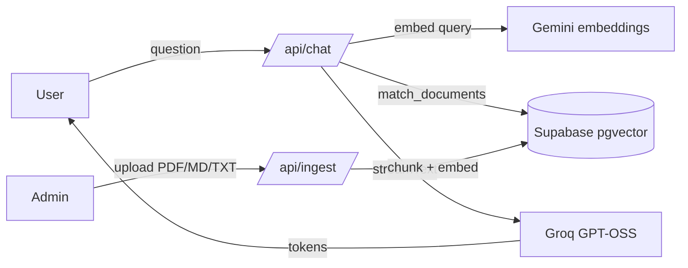

# ask-me-rag

A streaming RAG chatbot to ask about me.

## Screenshots


<!-- Please add a real screenshot of the chat interface here after deployment. -->

## Features

- **Streaming chat** — Real-time token streaming for responsive user experience
- **Groq + GPT‑OSS** — Geração rápida e com streaming pelo modelo open-weight `openai/gpt-oss-20b`
- **Runtimes separados** — Groq gera a resposta; Google ou Vertex gera os embeddings sem alterar o índice atual
- **RAG over personal documents** — Query answers from ingested PDFs, Markdown, and text files
- **Private ingestion workspace** — Manage sources behind an HTTP-only admin session
- **Multilingual support** — PT/EN language toggle within the chat
- **Vector search** — Fast semantic retrieval via Supabase pgvector

## Architecture


```mermaid
flowchart LR
  U[User] -->|question| C[/api/chat/]
  C -->|embed query| E[Gemini embeddings]
  C -->|match_documents| DB[(Supabase pgvector)]
  C -->|streamText| LLM[Groq GPT-OSS]
  LLM -->|tokens| U
  A[Admin] -->|upload PDF/MD/TXT| I[/api/ingest/]
  I -->|chunk + embed| DB
```

**Data flow:**

1. **User query** → `/api/chat` receives question
2. **Embeddings** → Query is embedded using Google `gemini-embedding-001` (1536 dims)
3. **Vector search** → Supabase pgvector retrieves matching documents
4. **LLM stream** → System prompt with context + user message is streamed through Groq GPT‑OSS
5. **Admin upload** → `/api/ingest` chunks documents, embeds, and stores in Supabase

## Setup

### Prerequisites

- Node.js 22+
- Docker Desktop (para banco e testes locais da observabilidade)
- Supabase account with a PostgreSQL database
- Uma chave da Groq para o chat — crie em [console.groq.com/keys](https://console.groq.com/keys)
- Uma chave do Google AI Studio para embeddings — crie em [aistudio.google.com/apikey](https://aistudio.google.com/apikey)

### Steps

1. **Clone the repository:**
   ```bash
   git clone <repo-url>
   cd llm-next-chat
   ```

2. **Install dependencies:**
   ```bash
   npm install
   ```

3. **Set up environment variables:**
   ```bash
   cp .env.example .env.local
   # Edit .env.local with your API keys and Supabase URL
   ```

4. **Initialize the database:**
   - Para um projeto Supabase existente, aplique todas as migrações versionadas:

   ~~~bash
   SUPABASE_DB_URL='postgresql://...' bash scripts/setup-db.sh
   ~~~

   - Para um banco novo, `0000_initial_schema.sql` cria a estrutura inicial e as demais migrações evoluem o schema em ordem. Não aplique arquivos manualmente fora dessa ordem.

5. **Start the development server:**

   ~~~bash
   npm run dev
   ~~~

   Open [http://localhost:3000](http://localhost:3000) in your browser.

## Testar a observabilidade localmente

Com Docker Desktop ativo, um único comando sobe o Supabase local mínimo (Postgres, PostgREST, gateway e Auth para as credenciais locais), recria o banco com todas as migrações, executa pgTAP e lint SQL, gera chaves efêmeras e inicia a aplicação:

~~~bash
npm run observability:local
~~~

O monitor fica em [http://localhost:3000/admin/observability](http://localhost:3000/admin/observability). A senha de teste é `local-observability-admin-2026`. Em outro terminal:

~~~bash
npm run observability:smoke
~~~

O smoke valida captura, IP mascarado, dispositivo, consulta, detalhe e exclusão. Para parar os contêineres:

~~~bash
npm run observability:local:stop
~~~

Detalhes de segurança, retenção e rollout estão em [docs/chat-observability.md](docs/chat-observability.md).

## Arquitetura RAG e controle de quota

O caminho padrão mantém chat e embeddings independentes:

- chat: `CHAT_LLM_PROVIDER=groq` com `openai/gpt-oss-20b`;
- embeddings: `EMBEDDING_PROVIDER=google` com `gemini-embedding-001` e 1536 dimensões;
- FAQs públicas determinísticas, cache e admissão acontecem antes de qualquer chamada faturável;
- limites persistentes por visitante, conversa e projeto protegem o teto diário;
- budgets de histórico, RAG e saída reduzem TPM e custo antes da geração.

A governança deve avançar de `off` para `shadow` e, após uma janela representativa, para `enforce`. Os defaults são 4 requisições/minuto e 50/dia por visitante, 500/dia no projeto e reserva operacional de 50. O reset diário acompanha `America/Los_Angeles`, que deve permanecer em `CHAT_QUOTA_RESET_TIME_ZONE`.

Respostas 429 são classificadas entre limitação transitória e quota esgotada. Retries com backoff e jitter só ocorrem antes do início do stream; depois do primeiro byte, a resposta é marcada como parcial e não é repetida automaticamente. Em risco de consumo, use `CHAT_LLM_KILL_SWITCH=true`.

O Vertex AI é opcional somente para embeddings e exige projeto/localização e ADC. Não use API key do Vertex, chave JSON ou arquivo em `gemini-profile/`. Veja [providers de IA](docs/ai-providers.md) e o [runbook de uso de IA](docs/ai-usage-runbook.md).

## Environment Variables

| Variable | Purpose | Example |
|----------|---------|---------|
| `CHAT_LLM_PROVIDER` | Provider de chat; somente `groq` nesta fase | `groq` |
| `CHAT_LLM_MODEL` | Modelo de chat Groq | `openai/gpt-oss-20b` |
| `GROQ_API_KEY` | Chave Groq obrigatória para o chat | (secret) |
| `EMBEDDING_PROVIDER` | Embedding provider: `google` or `vertex` | `google` |
| `EMBEDDING_MODEL` / `EMBEDDING_DIMENSION` | Fixed vector contract | `gemini-embedding-001` / `1536` |
| `GOOGLE_GENERATIVE_AI_API_KEY` | Chave Google AI Studio obrigatória para embeddings Google | (secret) |
| `GOOGLE_VERTEX_PROJECT` / `GOOGLE_VERTEX_LOCATION` | Projeto/localização opcionais para embeddings Vertex | `ask-me-rag` / `us-central1` |
| `CHAT_GOVERNANCE_MODE` | `off`, `shadow`, or `enforce` | `off` |
| `CHAT_LLM_KILL_SWITCH` | Stops new LLM calls while preserving deterministic FAQs | `false` |
| `CHAT_VISITOR_PER_MINUTE_LIMIT` / `CHAT_VISITOR_DAILY_LIMIT` | Per-visitor admission caps | `4` / `50` |
| `CHAT_GLOBAL_DAILY_LIMIT` / `CHAT_OPERATIONAL_RESERVE_DAILY` | Project cap and protected reserve | `500` / `50` |
| `CHAT_QUOTA_RESET_TIME_ZONE` | IANA timezone for the daily reset | `America/Los_Angeles` |
| `CHAT_HISTORY_TOKEN_BUDGET` / `CHAT_RAG_TOKEN_BUDGET` | Input sub-budgets | `4000` / `2000` |
| `CHAT_TOTAL_INPUT_TOKEN_BUDGET` / `CHAT_MAX_OUTPUT_TOKENS` | Total input/output budgets | `8000` / `500` |
| `CHAT_RESPONSE_CACHE_ENABLED` / `CHAT_EMBEDDING_CACHE_ENABLED` | Persistent cache flags | `false` / `false` |
| `NEXT_PUBLIC_SUPABASE_URL` | Supabase project URL | `https://<project>.supabase.co` |
| `SUPABASE_SERVICE_ROLE_KEY` | Supabase service role key (server-side only) | (secret) |
| `ADMIN_PASSWORD` | Shared secret for admin login; at least 20 chars in production | (secret) |
| `RAG_MATCH_THRESHOLD` | Minimum cosine similarity | `0.3` |
| `NEXT_PUBLIC_SITE_URL` | Canonical production URL | `https://portfolio.example.com` |
| `NEXT_PUBLIC_GITHUB_URL` | Public GitHub profile | `https://github.com/DanielTrindade` |
| `NEXT_PUBLIC_LINKEDIN_URL` / `NEXT_PUBLIC_RESUME_URL` | Optional public profile links | URL |

See `.env.example` for every supported flag, TTL and observability setting.

## Configuração dos providers de IA

Chat e embeddings são configurados separadamente. Reinicie o serviço após alterar o runtime.

- **Chat:** use `CHAT_LLM_PROVIDER=groq`, `CHAT_LLM_MODEL=openai/gpt-oss-20b` e `GROQ_API_KEY`. O modelo `openai/gpt-oss-120b` é um override opcional de maior qualidade e custo.
- **Embeddings Google (padrão):** use `EMBEDDING_PROVIDER=google` e `GOOGLE_GENERATIVE_AI_API_KEY`.
- **Embeddings Vertex:** use `EMBEDDING_PROVIDER=vertex`, configure projeto/localização e forneça ADC pela identidade do runtime. Nunca monte uma chave JSON.

Changing the embedding model or dimension requires re-ingesting all documents.

## Scope Decisions

This project is intentionally scoped to keep complexity low:

- **Admin authentication** — Uses a single shared secret (`ADMIN_PASSWORD`) validated by `POST /api/admin/login`, which sets an HTTP-only `askme_admin_session` cookie (timing-safe compare, in-memory rate limiting, ≥20-char password enforced in production). Routes under `/admin` and `/api/ingest` require this session and are additionally gated by `proxy.ts` (Next 16's middleware convention) as defense in depth. Not production-grade multi-user.
- **Embeddings** — Uses Google `gemini-embedding-001` through AI Studio or Vertex and remains pinned to 1536 dimensions. Changing this contract requires re-ingesting all documents.
- **Shared knowledge base** — All users query the same document store. No per-visitor isolation or personalization. Suitable for a single knowledge base about the project owner.
- **Session-only chat history** — Messages are kept only in the current browser session via `sessionStorage`; no conversation history is sent to persistent storage.
- **Development preview** — `next dev` returns a deterministic streamed Markdown response for visual QA without calling embeddings or an LLM. Production keeps the real RAG flow.

## Tech Stack

- **Framework:** Next.js 16 (App Router)
- **Language:** TypeScript
- **Styling:** Tailwind CSS v4 (CSS-based, no `tailwind.config.js`)
- **UI Components:** Astryx Design System with the neutral theme
- **Animations:** CSS transitions using Astryx motion tokens
- **LLM Integration:** Vercel AI SDK v6
- **Chat model:** Groq `openai/gpt-oss-20b`
- **Vector Database:** Supabase (PostgreSQL + pgvector)
- **Document Parsing:** unpdf
- **Embeddings:** Google `gemini-embedding-001` (1536 dims)

## Running Tests and Build

```bash
# Run unit tests
npm run test

# Build for production
npm run build

# Start production server
npm start
```

## CI/CD

Pull requests para `main` executam dois gates independentes:

- **Quality**: ESLint, testes, auditoria, build Next.js, Actionlint e build do contêiner.
- **Database migrations**: inicia um PostgreSQL Supabase descartável, reaplica todas as migrações, executa pgTAP e lint SQL.

Depois do merge, o job `Deploy production` só inicia se os dois gates passarem e a variável de **repositório** `GCP_DEPLOY_ENABLED` estiver como `true`. O fluxo usa OIDC, sem chave persistente do Google Cloud:

1. aplica as migrações Supabase de produção;
2. valida APIs, recursos, identidades e versões dos segredos;
3. constrói uma imagem identificada pelo SHA completo do commit;
4. resolve o digest imutável e cria uma revisão candidata sem tráfego;
5. testa `/api/health` na candidata;
6. confirma que o SHA ainda é o HEAD de `main`, promove 100% do tráfego e testa a URL pública;
7. restaura automaticamente a revisão anterior se a verificação pós-promoção falhar;
8. cria ou atualiza o job diário e o scheduler de retenção da observabilidade.

### Bootstrap único

Um administrador do projeto executa uma vez:

```bash
GCP_PROJECT_ID=ask-me-rag \
GITHUB_REPOSITORY=DanielTrindade/ask-me-rag \
bash scripts/bootstrap-gcp-cicd.sh
```

O bootstrap cria identidades dedicadas, configura Workload Identity Federation restrita ao repositório e à branch `main` e aplica papéis mínimos. Veja [docs/cicd-iam.md](docs/cicd-iam.md).

No environment `production` do GitHub, configure:

- variáveis: `GCP_PROJECT_ID`, `GCP_REGION`, `CLOUD_RUN_SERVICE`, `ARTIFACT_REPOSITORY`, `NEXT_PUBLIC_SUPABASE_URL`, `GCP_WORKLOAD_IDENTITY_PROVIDER`, `GCP_DEPLOY_SERVICE_ACCOUNT`, `CLOUD_BUILD_SERVICE_ACCOUNT`, `CHAT_OBSERVABILITY_ENABLED=false`, `CHAT_TRUSTED_PROXY_HOPS=unset` e `DEPLOY_OBSERVABILITY_RETENTION=true`;
- segredo: `SUPABASE_DB_URL`, com a conexão PostgreSQL direta ou pelo session pooler e `sslmode=require`.

No nível do **repositório** (Settings → Secrets and variables → Actions → Variables), configure `GCP_DEPLOY_ENABLED` (`gh variable set GCP_DEPLOY_ENABLED --body "true"`). Mantenha-a como `false` até o preflight e o primeiro ensaio serem aprovados. As credenciais da aplicação continuam no Secret Manager e não devem ser copiadas para o GitHub.

### Migrações

As migrações em `supabase/migrations/` são aplicadas antes do build:

```bash
SUPABASE_DB_URL='postgresql://...' bash scripts/setup-db.sh
```

Toda mudança deve seguir expand/contract para que a revisão nova e a anterior funcionem simultaneamente. Veja [docs/database-migrations.md](docs/database-migrations.md).

### Promoção manual e rollback

O workflow `Promote existing image` promove uma imagem já publicada pelo SHA completo, sem rebuild, usando os mesmos smoke tests. Esse é o procedimento de emergência para retornar a um SHA conhecido.

Se a candidata falhar, o tráfego permanece intacto. Se a falha ocorrer depois da promoção, o script devolve 100% do tráfego à revisão estável. Migrações não são revertidas automaticamente; corrija-as com uma nova migração compatível.

### Troubleshooting

- `Deploy production` ignorado: confirme `GCP_DEPLOY_ENABLED=true` como variável de **repositório** (`gh variable list`) — no environment `production` ela não tem efeito — e que o evento é push em `main`.
- OIDC recusado: o provider aceita somente `DanielTrindade/ask-me-rag` em `refs/heads/main`.
- Preflight falhou: execute `bash scripts/preflight-deploy.sh` com as mesmas variáveis do environment.
- Migração falhou: valide `SUPABASE_DB_URL`, conectividade e compatibilidade expand/contract.
- Smoke test falhou: consulte os logs da revisão candidata e a resposta não sensível de `/api/health`.
- Segredo rotacionado: crie uma nova versão no Secret Manager e faça uma promoção para gerar uma nova revisão.

## License

MIT
