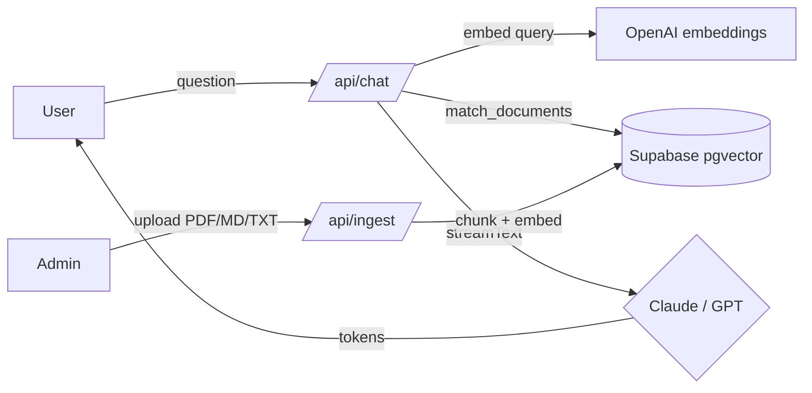

# ask-me-rag Implementation Plan

> **For agentic workers:** REQUIRED SUB-SKILL: Use superpowers:subagent-driven-development (recommended) or superpowers:executing-plans to implement this plan task-by-task. Steps use checkbox (`- [ ]`) syntax for tracking.

**Goal:** Build a portfolio-grade "Ask me about myself" chatbot with token streaming, switchable LLM provider (Claude ⇄ GPT), and simple RAG over the owner's documents (admin-protected upload), with a polished, craft-driven light UI and PT/EN i18n.

**Architecture:** Next.js 15 App Router. The Vercel AI SDK (`ai` + `@ai-sdk/anthropic` + `@ai-sdk/openai`) abstracts both providers behind a single `streamText` call and drives the client via `useChat`. RAG runs on Supabase Postgres + pgvector: documents are chunked, embedded with OpenAI `text-embedding-3-small`, and retrieved via a `match_documents` SQL function. Pure logic (chunking, provider selection, prompt building) is unit-tested with Vitest; DB- and network-touching glue is verified manually with documented commands.

**Tech Stack:** Next.js 15, TypeScript, Tailwind CSS, Radix UI, Motion, Vercel AI SDK v5, Supabase (pgvector), `unpdf`, Vitest.

## Global Constraints

- **Node:** 20+. **Next.js:** 15+ (App Router). **TypeScript:** strict mode on.
- **Vercel AI SDK:** v5+. Chat route returns `result.toUIMessageStreamResponse()`; client uses `useChat` from `@ai-sdk/react`. If the installed SDK's streaming API differs, consult current docs (context7: `/vercel/ai`) before improvising.
- **Embeddings:** always OpenAI `text-embedding-3-small` (1536 dims), regardless of chat provider. Anthropic has no embeddings API.
- **Provider switch:** `LLM_PROVIDER` env = `anthropic` | `openai`. Default `anthropic`.
- **Default models:** Anthropic `claude-sonnet-4-6`, OpenAI `gpt-4o-mini` (override via `ANTHROPIC_MODEL` / `OPENAI_MODEL`).
- **Admin auth:** single shared secret `ADMIN_PASSWORD`, sent as `x-admin-token` header. Deliberately simple — documented as a scope decision, no full auth.
- **i18n:** PT and EN, toggle in UI. No third language.
- **Secrets:** never commit `.env*`. Ship `.env.example` with every required var.
- **Visual style:** light & clean (Notion/Claude-like). Animate only purposeful moments; UI animations < 300ms; custom ease-out `cubic-bezier(0.23, 1, 0.32, 1)`; respect `prefers-reduced-motion`.
- **Commits:** conventional commits, one per task minimum.

---

### Task 1: Scaffold project + tooling

**Files:**
- Create: `package.json`, `tsconfig.json`, `next.config.ts`, `tailwind.config.ts`, `postcss.config.mjs`, `app/layout.tsx`, `app/page.tsx`, `app/globals.css`, `.gitignore`, `vitest.config.ts`
- Create: `.env.example`

**Interfaces:**
- Produces: a running Next.js dev server and a working `npm test` (Vitest) command that other tasks build on.

- [ ] **Step 1: Scaffold Next.js app in the current directory**

```bash
npx create-next-app@latest . --ts --tailwind --app --eslint --src-dir=false --import-alias "@/*" --no-turbopack --use-npm --yes
```

If the directory is non-empty (it contains `docs/` and `.git/`), scaffold in a temp dir and move files in:

```bash
npx create-next-app@latest .cna-tmp --ts --tailwind --app --eslint --src-dir=false --import-alias "@/*" --no-turbopack --use-npm --yes
# then move generated files (app/, package.json, configs, public/) into the project root, preserving existing docs/ and .git/
```

- [ ] **Step 2: Install runtime + dev dependencies**

```bash
npm install ai @ai-sdk/anthropic @ai-sdk/openai @ai-sdk/react @supabase/supabase-js unpdf @radix-ui/react-toast motion clsx
npm install -D vitest @vitejs/plugin-react jsdom @testing-library/react @testing-library/jest-dom
```

- [ ] **Step 3: Add Vitest config**

Create `vitest.config.ts`:

```ts
import { defineConfig } from 'vitest/config';
import react from '@vitejs/plugin-react';
import path from 'node:path';

export default defineConfig({
  plugins: [react()],
  test: {
    environment: 'jsdom',
    globals: true,
    include: ['**/*.test.ts', '**/*.test.tsx'],
  },
  resolve: {
    alias: { '@': path.resolve(__dirname, '.') },
  },
});
```

Add to `package.json` scripts: `"test": "vitest run"`, `"test:watch": "vitest"`.

- [ ] **Step 4: Create `.env.example`**

```bash
# LLM provider: "anthropic" or "openai"
LLM_PROVIDER=anthropic
ANTHROPIC_API_KEY=
OPENAI_API_KEY=
ANTHROPIC_MODEL=claude-sonnet-4-6
OPENAI_MODEL=gpt-4o-mini

# Supabase
NEXT_PUBLIC_SUPABASE_URL=
SUPABASE_SERVICE_ROLE_KEY=

# Admin upload secret
ADMIN_PASSWORD=
```

- [ ] **Step 5: Verify the toolchain**

Run: `npm run test -- --passWithNoTests` → Expected: exits 0.
Run: `npm run build` → Expected: build succeeds.

- [ ] **Step 6: Commit**

```bash
git add -A
git commit -m "chore: scaffold next.js app with tailwind, vitest, and core deps"
```

---

### Task 2: Supabase schema (documents + match_documents)

**Files:**
- Create: `supabase/schema.sql`

**Interfaces:**
- Produces: table `documents(id, content, embedding vector(1536), metadata jsonb, created_at)` and RPC `match_documents(query_embedding vector(1536), match_count int, match_threshold float)` returning `(id, content, metadata, similarity)`. `lib/rag.ts` (Task 7) calls this RPC.

- [ ] **Step 1: Write `supabase/schema.sql`**

```sql
-- Enable pgvector
create extension if not exists vector;

-- Documents table (one row per chunk)
create table if not exists documents (
  id bigint generated always as identity primary key,
  content text not null,
  embedding vector(1536),
  metadata jsonb default '{}'::jsonb,
  created_at timestamptz default now()
);

-- ANN index for cosine similarity
create index if not exists documents_embedding_idx
  on documents using hnsw (embedding vector_cosine_ops);

-- Similarity search function
create or replace function match_documents (
  query_embedding vector(1536),
  match_count int default 5,
  match_threshold float default 0.3
)
returns table (
  id bigint,
  content text,
  metadata jsonb,
  similarity float
)
language sql stable
as $$
  select
    documents.id,
    documents.content,
    documents.metadata,
    1 - (documents.embedding <=> query_embedding) as similarity
  from documents
  where 1 - (documents.embedding <=> query_embedding) > match_threshold
  order by documents.embedding <=> query_embedding
  limit match_count;
$$;
```

- [ ] **Step 2: Verify (manual)**

In the Supabase SQL editor, run the file. Expected: no errors; `documents` table and `match_documents` function appear. (This step is documented in the README for the human running setup; no automated test.)

- [ ] **Step 3: Commit**

```bash
git add supabase/schema.sql
git commit -m "feat: add supabase pgvector schema and match_documents function"
```

---

### Task 3: Text chunking (`lib/chunk.ts`)

**Files:**
- Create: `lib/chunk.ts`
- Test: `lib/chunk.test.ts`

**Interfaces:**
- Produces: `chunkText(text: string, opts?: { size?: number; overlap?: number }): Chunk[]` where `interface Chunk { content: string; index: number }`. Defaults `size = 2000` chars, `overlap = 200` chars (≈500 tokens). Task 9 (ingest) consumes this.

- [ ] **Step 1: Write the failing test**

```ts
import { describe, it, expect } from 'vitest';
import { chunkText } from '@/lib/chunk';

describe('chunkText', () => {
  it('returns a single chunk for short text', () => {
    const chunks = chunkText('hello world');
    expect(chunks).toEqual([{ content: 'hello world', index: 0 }]);
  });

  it('splits long text into overlapping chunks', () => {
    const text = 'a'.repeat(2500);
    const chunks = chunkText(text, { size: 1000, overlap: 100 });
    expect(chunks.length).toBe(3);
    expect(chunks[0].content.length).toBe(1000);
    // overlap: chunk 1 starts 100 chars before chunk 0 ended
    expect(chunks[1].content[0]).toBe('a');
    expect(chunks.map((c) => c.index)).toEqual([0, 1, 2]);
  });

  it('ignores empty/whitespace-only input', () => {
    expect(chunkText('   ')).toEqual([]);
  });
});
```

- [ ] **Step 2: Run test to verify it fails**

Run: `npm run test -- lib/chunk.test.ts`
Expected: FAIL — cannot find module `@/lib/chunk`.

- [ ] **Step 3: Write minimal implementation**

```ts
export interface Chunk {
  content: string;
  index: number;
}

export function chunkText(
  text: string,
  opts: { size?: number; overlap?: number } = {},
): Chunk[] {
  const size = opts.size ?? 2000;
  const overlap = opts.overlap ?? 200;
  const trimmed = text.trim();
  if (!trimmed) return [];

  const chunks: Chunk[] = [];
  const step = Math.max(1, size - overlap);
  let index = 0;
  for (let start = 0; start < trimmed.length; start += step) {
    const content = trimmed.slice(start, start + size);
    chunks.push({ content, index: index++ });
    if (start + size >= trimmed.length) break;
  }
  return chunks;
}
```

- [ ] **Step 4: Run test to verify it passes**

Run: `npm run test -- lib/chunk.test.ts` → Expected: PASS (3 tests).

- [ ] **Step 5: Commit**

```bash
git add lib/chunk.ts lib/chunk.test.ts
git commit -m "feat: add overlapping text chunker with tests"
```

---

### Task 4: Provider selection (`lib/llm.ts`)

**Files:**
- Create: `lib/llm.ts`
- Test: `lib/llm.test.ts`

**Interfaces:**
- Produces:
  - `type Provider = 'anthropic' | 'openai'`
  - `getProvider(): Provider` — reads `LLM_PROVIDER`, defaults `'anthropic'`.
  - `getModel(provider?: Provider): LanguageModel` — returns the AI SDK model object. Task 8 (chat route) consumes `getModel()`.

- [ ] **Step 1: Write the failing test**

```ts
import { describe, it, expect, afterEach } from 'vitest';
import { getProvider } from '@/lib/llm';

afterEach(() => {
  delete process.env.LLM_PROVIDER;
});

describe('getProvider', () => {
  it('defaults to anthropic when unset', () => {
    expect(getProvider()).toBe('anthropic');
  });
  it('returns openai when LLM_PROVIDER=openai', () => {
    process.env.LLM_PROVIDER = 'openai';
    expect(getProvider()).toBe('openai');
  });
  it('falls back to anthropic for unknown values', () => {
    process.env.LLM_PROVIDER = 'banana';
    expect(getProvider()).toBe('anthropic');
  });
});
```

- [ ] **Step 2: Run test to verify it fails**

Run: `npm run test -- lib/llm.test.ts` → Expected: FAIL — module not found.

- [ ] **Step 3: Write minimal implementation**

```ts
import { anthropic } from '@ai-sdk/anthropic';
import { openai } from '@ai-sdk/openai';
import type { LanguageModel } from 'ai';

export type Provider = 'anthropic' | 'openai';

export function getProvider(): Provider {
  return process.env.LLM_PROVIDER === 'openai' ? 'openai' : 'anthropic';
}

export function getModel(provider: Provider = getProvider()): LanguageModel {
  if (provider === 'openai') {
    return openai(process.env.OPENAI_MODEL ?? 'gpt-4o-mini');
  }
  return anthropic(process.env.ANTHROPIC_MODEL ?? 'claude-sonnet-4-6');
}
```

- [ ] **Step 4: Run test to verify it passes**

Run: `npm run test -- lib/llm.test.ts` → Expected: PASS (3 tests).

- [ ] **Step 5: Commit**

```bash
git add lib/llm.ts lib/llm.test.ts
git commit -m "feat: add switchable llm provider selection"
```

---

### Task 5: Embeddings + Supabase clients (`lib/embeddings.ts`, `lib/supabase.ts`)

**Files:**
- Create: `lib/embeddings.ts`, `lib/supabase.ts`

**Interfaces:**
- Produces:
  - `embedText(text: string): Promise<number[]>`
  - `embedTexts(texts: string[]): Promise<number[][]>`
  - `getServiceClient(): SupabaseClient` — service-role client for server-side writes/RPC.

- [ ] **Step 1: Write `lib/embeddings.ts`**

```ts
import { openai } from '@ai-sdk/openai';
import { embed, embedMany } from 'ai';

const embeddingModel = openai.embedding('text-embedding-3-small');

export async function embedText(text: string): Promise<number[]> {
  const { embedding } = await embed({ model: embeddingModel, value: text });
  return embedding;
}

export async function embedTexts(texts: string[]): Promise<number[][]> {
  const { embeddings } = await embedMany({ model: embeddingModel, values: texts });
  return embeddings;
}
```

- [ ] **Step 2: Write `lib/supabase.ts`**

```ts
import { createClient, type SupabaseClient } from '@supabase/supabase-js';

let client: SupabaseClient | null = null;

export function getServiceClient(): SupabaseClient {
  if (client) return client;
  const url = process.env.NEXT_PUBLIC_SUPABASE_URL;
  const key = process.env.SUPABASE_SERVICE_ROLE_KEY;
  if (!url || !key) {
    throw new Error('Missing NEXT_PUBLIC_SUPABASE_URL or SUPABASE_SERVICE_ROLE_KEY');
  }
  client = createClient(url, key, { auth: { persistSession: false } });
  return client;
}
```

- [ ] **Step 3: Verify types compile**

Run: `npx tsc --noEmit` → Expected: no errors.

- [ ] **Step 4: Commit**

```bash
git add lib/embeddings.ts lib/supabase.ts
git commit -m "feat: add openai embeddings wrapper and supabase service client"
```

---

### Task 6: RAG retrieval + prompt (`lib/rag.ts`)

**Files:**
- Create: `lib/rag.ts`
- Test: `lib/rag.test.ts`

**Interfaces:**
- Consumes: `embedText` (Task 5), `getServiceClient` (Task 5), `match_documents` RPC (Task 2).
- Produces:
  - `buildSystemPrompt(context: string): string` — pure; embeds retrieved context + anti-hallucination instruction.
  - `retrieveContext(query: string, opts?: { matchCount?: number }): Promise<string>` — embeds query, calls RPC, joins chunk contents with `\n\n---\n\n`.
  - Task 8 (chat route) consumes both.

- [ ] **Step 1: Write the failing test (pure helper)**

```ts
import { describe, it, expect } from 'vitest';
import { buildSystemPrompt } from '@/lib/rag';

describe('buildSystemPrompt', () => {
  it('includes the provided context', () => {
    const prompt = buildSystemPrompt('Daniel worked at ACME.');
    expect(prompt).toContain('Daniel worked at ACME.');
  });
  it('instructs the model not to invent answers', () => {
    const prompt = buildSystemPrompt('');
    expect(prompt.toLowerCase()).toContain("don't know");
  });
});
```

- [ ] **Step 2: Run test to verify it fails**

Run: `npm run test -- lib/rag.test.ts` → Expected: FAIL — module not found.

- [ ] **Step 3: Write minimal implementation**

```ts
import { embedText } from '@/lib/embeddings';
import { getServiceClient } from '@/lib/supabase';

export function buildSystemPrompt(context: string): string {
  return [
    'You are a helpful assistant that answers questions about the portfolio owner,',
    'using ONLY the context below. If the answer is not in the context, say you',
    "don't know rather than inventing facts. Answer in the same language as the question.",
    '',
    '--- CONTEXT ---',
    context || '(no relevant context found)',
    '--- END CONTEXT ---',
  ].join('\n');
}

export async function retrieveContext(
  query: string,
  opts: { matchCount?: number } = {},
): Promise<string> {
  if (!query.trim()) return '';
  const embedding = await embedText(query);
  const supabase = getServiceClient();
  const { data, error } = await supabase.rpc('match_documents', {
    query_embedding: embedding,
    match_count: opts.matchCount ?? 5,
    match_threshold: 0.3,
  });
  if (error) throw new Error(`match_documents failed: ${error.message}`);
  return (data ?? [])
    .map((row: { content: string }) => row.content)
    .join('\n\n---\n\n');
}
```

- [ ] **Step 4: Run test to verify it passes**

Run: `npm run test -- lib/rag.test.ts` → Expected: PASS (2 tests).

- [ ] **Step 5: Commit**

```bash
git add lib/rag.ts lib/rag.test.ts
git commit -m "feat: add rag retrieval and system prompt builder"
```

---

### Task 7: Chat API route (`app/api/chat/route.ts`)

**Files:**
- Create: `app/api/chat/route.ts`

**Interfaces:**
- Consumes: `getModel` (Task 4), `retrieveContext` + `buildSystemPrompt` (Task 6).
- Produces: `POST /api/chat` accepting `{ messages }` (UI message format) and returning a UI message stream. Task 11 (chat UI) consumes it via `useChat`.

- [ ] **Step 1: Write the route**

```ts
import { streamText, convertToModelMessages, type UIMessage } from 'ai';
import { getModel } from '@/lib/llm';
import { retrieveContext, buildSystemPrompt } from '@/lib/rag';

export const maxDuration = 30;

export async function POST(req: Request) {
  const { messages }: { messages: UIMessage[] } = await req.json();

  const lastUser = [...messages].reverse().find((m) => m.role === 'user');
  const queryText =
    lastUser?.parts
      ?.filter((p) => p.type === 'text')
      .map((p) => (p as { text: string }).text)
      .join(' ') ?? '';

  const context = await retrieveContext(queryText);

  const result = streamText({
    model: getModel(),
    system: buildSystemPrompt(context),
    messages: convertToModelMessages(messages),
  });

  return result.toUIMessageStreamResponse();
}
```

> If the installed AI SDK version exposes a different message shape or response helper, verify against current docs (context7 `/vercel/ai`) and adapt this route — the contract (POST `{messages}` → streamed assistant reply) must stay the same.

- [ ] **Step 2: Verify it compiles and the dev server boots**

Run: `npx tsc --noEmit` → Expected: no errors.
Run: `npm run dev`, then (with valid `.env.local` + seeded DB) POST a sample message; Expected: a streamed text response. Without env, expect a clear runtime error — acceptable at this stage.

- [ ] **Step 3: Commit**

```bash
git add app/api/chat/route.ts
git commit -m "feat: add streaming chat route with rag context"
```

---

### Task 8: Ingest API route (`app/api/ingest/route.ts`)

**Files:**
- Create: `app/api/ingest/route.ts`
- Create: `lib/extract.ts`
- Test: `lib/extract.test.ts`

**Interfaces:**
- Consumes: `chunkText` (Task 3), `embedTexts` (Task 5), `getServiceClient` (Task 5).
- Produces:
  - `lib/extract.ts`: `extractText(file: { name: string; arrayBuffer(): Promise<ArrayBuffer>; text(): Promise<string> }): Promise<string>` — uses `unpdf` for `.pdf`, `file.text()` otherwise.
  - `POST /api/ingest` (multipart form, `file` field) guarded by `x-admin-token` === `ADMIN_PASSWORD`. Returns `{ inserted: number }`.

- [ ] **Step 1: Write the failing test for extension routing**

```ts
import { describe, it, expect } from 'vitest';
import { isPdf } from '@/lib/extract';

describe('isPdf', () => {
  it('detects pdf by extension', () => {
    expect(isPdf('cv.pdf')).toBe(true);
    expect(isPdf('CV.PDF')).toBe(true);
  });
  it('returns false for text files', () => {
    expect(isPdf('notes.md')).toBe(false);
    expect(isPdf('bio.txt')).toBe(false);
  });
});
```

- [ ] **Step 2: Run test to verify it fails**

Run: `npm run test -- lib/extract.test.ts` → Expected: FAIL — module not found.

- [ ] **Step 3: Implement `lib/extract.ts`**

```ts
import { extractText as extractPdfText, getDocumentProxy } from 'unpdf';

export function isPdf(filename: string): boolean {
  return filename.toLowerCase().endsWith('.pdf');
}

interface FileLike {
  name: string;
  arrayBuffer(): Promise<ArrayBuffer>;
  text(): Promise<string>;
}

export async function extractText(file: FileLike): Promise<string> {
  if (isPdf(file.name)) {
    const buf = new Uint8Array(await file.arrayBuffer());
    const pdf = await getDocumentProxy(buf);
    const { text } = await extractPdfText(pdf, { mergePages: true });
    return text;
  }
  return file.text();
}
```

- [ ] **Step 4: Run test to verify it passes**

Run: `npm run test -- lib/extract.test.ts` → Expected: PASS (2 tests).

- [ ] **Step 5: Implement the ingest route**

```ts
import { extractText } from '@/lib/extract';
import { chunkText } from '@/lib/chunk';
import { embedTexts } from '@/lib/embeddings';
import { getServiceClient } from '@/lib/supabase';

export const maxDuration = 60;

const ALLOWED = ['.pdf', '.md', '.txt'];
const MAX_BYTES = 10 * 1024 * 1024; // 10MB

export async function POST(req: Request) {
  if (req.headers.get('x-admin-token') !== process.env.ADMIN_PASSWORD) {
    return Response.json({ error: 'Unauthorized' }, { status: 401 });
  }

  const form = await req.formData();
  const file = form.get('file');
  if (!(file instanceof File)) {
    return Response.json({ error: 'No file provided' }, { status: 400 });
  }
  const lower = file.name.toLowerCase();
  if (!ALLOWED.some((ext) => lower.endsWith(ext))) {
    return Response.json({ error: 'Unsupported file type' }, { status: 400 });
  }
  if (file.size > MAX_BYTES) {
    return Response.json({ error: 'File too large (max 10MB)' }, { status: 400 });
  }

  const text = await extractText(file);
  const chunks = chunkText(text);
  if (chunks.length === 0) {
    return Response.json({ error: 'No text extracted' }, { status: 422 });
  }

  const embeddings = await embedTexts(chunks.map((c) => c.content));
  const rows = chunks.map((c, i) => ({
    content: c.content,
    embedding: embeddings[i],
    metadata: { source: file.name, chunk: c.index },
  }));

  const supabase = getServiceClient();
  const { error } = await supabase.from('documents').insert(rows);
  if (error) {
    return Response.json({ error: error.message }, { status: 500 });
  }
  return Response.json({ inserted: rows.length });
}
```

- [ ] **Step 6: Verify compile**

Run: `npx tsc --noEmit` → Expected: no errors.

- [ ] **Step 7: Commit**

```bash
git add app/api/ingest/route.ts lib/extract.ts lib/extract.test.ts
git commit -m "feat: add admin-protected ingest route with pdf/text extraction"
```

---

### Task 9: i18n dictionary (`lib/i18n.ts`)

**Files:**
- Create: `lib/i18n.ts`
- Test: `lib/i18n.test.ts`

**Interfaces:**
- Produces:
  - `type Locale = 'pt' | 'en'`
  - `dictionaries: Record<Locale, Record<string, string>>`
  - `t(locale: Locale, key: string): string` — returns the string, falling back to the key.
  - Tasks 11 & 12 (UI) consume these.

- [ ] **Step 1: Write the failing test**

```ts
import { describe, it, expect } from 'vitest';
import { t } from '@/lib/i18n';

describe('t', () => {
  it('returns the pt string', () => {
    expect(t('pt', 'chat.placeholder')).toMatch(/pergunte/i);
  });
  it('returns the en string', () => {
    expect(t('en', 'chat.placeholder')).toMatch(/ask/i);
  });
  it('falls back to the key when missing', () => {
    expect(t('en', 'nonexistent.key')).toBe('nonexistent.key');
  });
});
```

- [ ] **Step 2: Run test to verify it fails**

Run: `npm run test -- lib/i18n.test.ts` → Expected: FAIL — module not found.

- [ ] **Step 3: Write minimal implementation**

```ts
export type Locale = 'pt' | 'en';

export const dictionaries: Record<Locale, Record<string, string>> = {
  pt: {
    'app.title': 'Pergunte sobre mim',
    'app.subtitle': 'Um chatbot com RAG sobre minha trajetória.',
    'chat.placeholder': 'Pergunte sobre minha experiência…',
    'chat.send': 'Enviar',
    'chat.thinking': 'Pensando…',
    'chat.error': 'Algo deu errado. Tente novamente.',
    'admin.title': 'Upload de documentos',
    'admin.password': 'Senha de admin',
    'admin.upload': 'Enviar arquivo',
    'admin.success': 'Documento indexado com sucesso.',
  },
  en: {
    'app.title': 'Ask me about myself',
    'app.subtitle': 'A RAG chatbot about my background.',
    'chat.placeholder': 'Ask about my experience…',
    'chat.send': 'Send',
    'chat.thinking': 'Thinking…',
    'chat.error': 'Something went wrong. Try again.',
    'admin.title': 'Upload documents',
    'admin.password': 'Admin password',
    'admin.upload': 'Upload file',
    'admin.success': 'Document indexed successfully.',
  },
};

export function t(locale: Locale, key: string): string {
  return dictionaries[locale]?.[key] ?? key;
}
```

- [ ] **Step 4: Run test to verify it passes**

Run: `npm run test -- lib/i18n.test.ts` → Expected: PASS (3 tests).

- [ ] **Step 5: Commit**

```bash
git add lib/i18n.ts lib/i18n.test.ts
git commit -m "feat: add pt/en i18n dictionary"
```

---

### Task 10: UI primitives — design tokens, Button, Toast (`components/ui/`, `app/globals.css`)

**Files:**
- Modify: `app/globals.css`
- Create: `components/ui/button.tsx`, `components/ui/toast.tsx`, `lib/cn.ts`

**Interfaces:**
- Produces:
  - `cn(...classes)` helper (clsx wrapper).
  - `<Button>` with craft press feedback.
  - `<ToastProvider>` + `useToast()` for error toasts. Tasks 11 & 12 consume these.

- [ ] **Step 1: Add design tokens + easing to `app/globals.css`**

Append:

```css
:root {
  --bg: #ffffff;
  --surface: #f7f7f5;
  --text: #1a1a1a;
  --muted: #6b7280;
  --accent: #2563eb;
  --border: #e5e7eb;
  --ease-out: cubic-bezier(0.23, 1, 0.32, 1);
}

body {
  background: var(--bg);
  color: var(--text);
  font-family: ui-sans-serif, system-ui, -apple-system, sans-serif;
}

@media (prefers-reduced-motion: reduce) {
  * {
    animation-duration: 0.01ms !important;
    transition-duration: 0.01ms !important;
  }
}
```

- [ ] **Step 2: Create `lib/cn.ts`**

```ts
import clsx, { type ClassValue } from 'clsx';
export function cn(...inputs: ClassValue[]): string {
  return clsx(inputs);
}
```

- [ ] **Step 3: Create `components/ui/button.tsx`**

```tsx
'use client';
import { cn } from '@/lib/cn';
import type { ButtonHTMLAttributes } from 'react';

export function Button({ className, ...props }: ButtonHTMLAttributes<HTMLButtonElement>) {
  return (
    <button
      className={cn(
        'inline-flex items-center justify-center rounded-lg bg-[var(--accent)] px-4 py-2',
        'text-white font-medium transition-transform duration-150 ease-out',
        'active:scale-[0.97] disabled:opacity-50 disabled:active:scale-100',
        className,
      )}
      {...props}
    />
  );
}
```

The press feedback (`active:scale-[0.97]`, 150ms ease-out) follows the craft rules: instant, subtle, < 160ms.

- [ ] **Step 4: Create `components/ui/toast.tsx`**

```tsx
'use client';
import * as Toast from '@radix-ui/react-toast';
import { createContext, useContext, useState, type ReactNode } from 'react';

const ToastCtx = createContext<(msg: string) => void>(() => {});
export const useToast = () => useContext(ToastCtx);

export function ToastProvider({ children }: { children: ReactNode }) {
  const [msg, setMsg] = useState('');
  const [open, setOpen] = useState(false);
  const show = (m: string) => {
    setMsg(m);
    setOpen(false);
    requestAnimationFrame(() => setOpen(true));
  };
  return (
    <ToastCtx.Provider value={show}>
      <Toast.Provider swipeDirection="right">
        {children}
        <Toast.Root
          open={open}
          onOpenChange={setOpen}
          duration={4000}
          className="rounded-lg border border-[var(--border)] bg-white px-4 py-3 shadow-lg
                     data-[state=open]:animate-in data-[state=closed]:animate-out
                     data-[state=closed]:fade-out data-[state=open]:fade-in"
        >
          <Toast.Description className="text-sm text-[var(--text)]">{msg}</Toast.Description>
        </Toast.Root>
        <Toast.Viewport className="fixed bottom-4 right-4 z-50 flex w-80 flex-col gap-2" />
      </Toast.Provider>
    </ToastCtx.Provider>
  );
}
```

- [ ] **Step 5: Verify compile**

Run: `npx tsc --noEmit` → Expected: no errors.

- [ ] **Step 6: Commit**

```bash
git add app/globals.css components/ui lib/cn.ts
git commit -m "feat: add design tokens, button, and toast primitives"
```

---

### Task 11: Chat UI (`app/page.tsx`, `components/chat/`)

**Files:**
- Modify: `app/page.tsx`
- Create: `components/chat/chat.tsx`, `components/chat/message.tsx`, `components/locale-toggle.tsx`
- Modify: `app/layout.tsx` (wrap with `ToastProvider`)

**Interfaces:**
- Consumes: `useChat` → `/api/chat` (Task 7), `t`/`Locale` (Task 9), `Button`/`useToast` (Task 10).
- Produces: the public chat page with streaming, message entrance animation, thinking indicator, and PT/EN toggle.

- [ ] **Step 1: Wrap layout with ToastProvider**

In `app/layout.tsx`, import and wrap `{children}` with `<ToastProvider>`. Set `<html lang="en">` default.

- [ ] **Step 2: Create `components/chat/message.tsx`**

```tsx
'use client';
import { cn } from '@/lib/cn';

export function Message({ role, children }: { role: string; children: React.ReactNode }) {
  const isUser = role === 'user';
  return (
    <div
      className={cn(
        'max-w-[80%] rounded-2xl px-4 py-2.5 text-[15px] leading-relaxed',
        'motion-safe:animate-[msgIn_300ms_var(--ease-out)]',
        isUser
          ? 'self-end bg-[var(--accent)] text-white'
          : 'self-start bg-[var(--surface)] text-[var(--text)]',
      )}
    >
      {children}
    </div>
  );
}
```

Add the keyframe to `app/globals.css`:

```css
@keyframes msgIn {
  from { opacity: 0; transform: translateY(8px); }
  to   { opacity: 1; transform: translateY(0); }
}
```

Only `opacity`/`transform` animate (GPU-friendly), 300ms ease-out, gated by `motion-safe`.

- [ ] **Step 3: Create `components/locale-toggle.tsx`**

```tsx
'use client';
import type { Locale } from '@/lib/i18n';

export function LocaleToggle({ locale, onChange }: { locale: Locale; onChange: (l: Locale) => void }) {
  return (
    <button
      onClick={() => onChange(locale === 'pt' ? 'en' : 'pt')}
      className="rounded-md border border-[var(--border)] px-2 py-1 text-xs text-[var(--muted)]
                 transition-transform duration-150 ease-out active:scale-[0.97]"
    >
      {locale === 'pt' ? '🇧🇷 PT' : '🇺🇸 EN'}
    </button>
  );
}
```

- [ ] **Step 4: Create `components/chat/chat.tsx`**

```tsx
'use client';
import { useChat } from '@ai-sdk/react';
import { useState } from 'react';
import { Message } from './message';
import { LocaleToggle } from '@/components/locale-toggle';
import { Button } from '@/components/ui/button';
import { useToast } from '@/components/ui/toast';
import { t, type Locale } from '@/lib/i18n';

export function Chat() {
  const [locale, setLocale] = useState<Locale>('pt');
  const [input, setInput] = useState('');
  const toast = useToast();
  const { messages, sendMessage, status } = useChat({
    onError: () => toast(t(locale, 'chat.error')),
  });
  const busy = status === 'submitted' || status === 'streaming';

  return (
    <div className="mx-auto flex h-dvh max-w-2xl flex-col px-4 py-6">
      <header className="mb-4 flex items-center justify-between">
        <div>
          <h1 className="text-xl font-semibold">{t(locale, 'app.title')}</h1>
          <p className="text-sm text-[var(--muted)]">{t(locale, 'app.subtitle')}</p>
        </div>
        <LocaleToggle locale={locale} onChange={setLocale} />
      </header>

      <div className="flex flex-1 flex-col gap-3 overflow-y-auto pb-4">
        {messages.map((m) => (
          <Message key={m.id} role={m.role}>
            {m.parts.map((p, i) => (p.type === 'text' ? <span key={i}>{p.text}</span> : null))}
          </Message>
        ))}
        {busy && messages[messages.length - 1]?.role === 'user' && (
          <div className="self-start text-sm text-[var(--muted)]">{t(locale, 'chat.thinking')}</div>
        )}
      </div>

      <form
        onSubmit={(e) => {
          e.preventDefault();
          if (!input.trim() || busy) return;
          sendMessage({ text: input });
          setInput('');
        }}
        className="flex gap-2 border-t border-[var(--border)] pt-4"
      >
        <input
          value={input}
          onChange={(e) => setInput(e.target.value)}
          placeholder={t(locale, 'chat.placeholder')}
          className="flex-1 rounded-lg border border-[var(--border)] px-3 py-2 outline-none
                     focus:border-[var(--accent)]"
        />
        <Button type="submit" disabled={busy}>
          {t(locale, 'chat.send')}
        </Button>
      </form>
    </div>
  );
}
```

> `useChat`/`sendMessage`/`status` reflect AI SDK v5. If the installed version differs, adapt the hook usage per current docs while keeping the same UX.

- [ ] **Step 5: Wire `app/page.tsx`**

```tsx
import { Chat } from '@/components/chat/chat';
export default function Home() {
  return <Chat />;
}
```

- [ ] **Step 6: Verify**

Run: `npx tsc --noEmit` → Expected: no errors.
Run: `npm run build` → Expected: build succeeds.
Manual (with env + seeded DB): `npm run dev`, open `/`, send a question → tokens stream into an assistant bubble; toggle PT/EN swaps copy.

- [ ] **Step 7: Commit**

```bash
git add app/page.tsx app/layout.tsx components/chat components/locale-toggle.tsx app/globals.css
git commit -m "feat: add streaming chat UI with i18n and craft animations"
```

---

### Task 12: Admin upload UI (`app/admin/page.tsx`, `components/upload/`)

**Files:**
- Create: `app/admin/page.tsx`, `components/upload/upload-form.tsx`

**Interfaces:**
- Consumes: `/api/ingest` (Task 8), `Button`/`useToast` (Task 10), `t`/`Locale` (Task 9).
- Produces: a password-gated upload form that POSTs the file with `x-admin-token`.

- [ ] **Step 1: Create `components/upload/upload-form.tsx`**

```tsx
'use client';
import { useState } from 'react';
import { Button } from '@/components/ui/button';
import { useToast } from '@/components/ui/toast';
import { t } from '@/lib/i18n';

export function UploadForm() {
  const [password, setPassword] = useState('');
  const [file, setFile] = useState<File | null>(null);
  const [busy, setBusy] = useState(false);
  const toast = useToast();

  async function onSubmit(e: React.FormEvent) {
    e.preventDefault();
    if (!file) return;
    setBusy(true);
    try {
      const form = new FormData();
      form.append('file', file);
      const res = await fetch('/api/ingest', {
        method: 'POST',
        headers: { 'x-admin-token': password },
        body: form,
      });
      const data = await res.json();
      if (!res.ok) throw new Error(data.error ?? 'failed');
      toast(t('en', 'admin.success') + ` (${data.inserted} chunks)`);
      setFile(null);
    } catch (err) {
      toast(err instanceof Error ? err.message : 'Upload failed');
    } finally {
      setBusy(false);
    }
  }

  return (
    <form onSubmit={onSubmit} className="flex flex-col gap-4">
      <input
        type="password"
        placeholder={t('en', 'admin.password')}
        value={password}
        onChange={(e) => setPassword(e.target.value)}
        className="rounded-lg border border-[var(--border)] px-3 py-2 outline-none focus:border-[var(--accent)]"
      />
      <input
        type="file"
        accept=".pdf,.md,.txt"
        onChange={(e) => setFile(e.target.files?.[0] ?? null)}
        className="text-sm"
      />
      <Button type="submit" disabled={!file || !password || busy}>
        {busy ? '…' : t('en', 'admin.upload')}
      </Button>
    </form>
  );
}
```

- [ ] **Step 2: Create `app/admin/page.tsx`**

```tsx
import { UploadForm } from '@/components/upload/upload-form';
import { t } from '@/lib/i18n';

export default function AdminPage() {
  return (
    <main className="mx-auto max-w-md px-4 py-12">
      <h1 className="mb-6 text-xl font-semibold">{t('en', 'admin.title')}</h1>
      <UploadForm />
    </main>
  );
}
```

- [ ] **Step 3: Verify**

Run: `npx tsc --noEmit` → Expected: no errors.
Run: `npm run build` → Expected: build succeeds.
Manual (with env + DB): open `/admin`, enter password + a `.txt`/`.pdf`, submit → success toast with chunk count; wrong password → "Unauthorized" toast.

- [ ] **Step 4: Commit**

```bash
git add app/admin components/upload
git commit -m "feat: add admin-protected document upload UI"
```

---

### Task 13: README + portfolio polish

**Files:**
- Create: `README.md`
- Modify: `.env.example` (already created; ensure complete)

**Interfaces:**
- Produces: the portfolio-facing documentation. No code consumers.

- [ ] **Step 1: Write `README.md`**

Include, in order:
1. **Title + one-liner**: "ask-me-rag — a streaming RAG chatbot to ask about me."
2. **Screenshots/GIF placeholder**: `` (note to add real captures).
3. **Features**: streaming, switchable Claude/GPT, RAG over personal docs, admin upload, PT/EN.
4. **Architecture diagram** (Mermaid):



5. **Setup**: clone, `npm install`, copy `.env.example` → `.env.local`, run `supabase/schema.sql` in Supabase, `npm run dev`.
6. **Environment variables**: table describing each var.
7. **Switching providers**: set `LLM_PROVIDER`.
8. **Scope decisions** (be explicit): admin auth is a single shared secret by design; embeddings always use OpenAI (Anthropic has none); single shared knowledge base (no per-visitor isolation).
9. **Tech stack** + **license**.

- [ ] **Step 2: Verify the full suite once more**

Run: `npm run test` → Expected: all unit tests pass.
Run: `npm run build` → Expected: build succeeds.

- [ ] **Step 3: Commit**

```bash
git add README.md .env.example
git commit -m "docs: add README with architecture diagram and setup guide"
```

---

## Self-Review

**Spec coverage:**
- Stack (Next/TS/Tailwind/Radix/Motion/AI SDK/Supabase/unpdf) → Task 1, 10.
- Vercel AI SDK provider abstraction + streaming → Tasks 4, 7, 11.
- Embeddings OpenAI `text-embedding-3-small` → Task 5.
- Supabase pgvector + `match_documents` → Task 2, 6.
- Chunking → Task 3. RAG retrieval + anti-hallucination prompt → Task 6.
- Admin-protected upload + `unpdf` + validation → Task 8, 12.
- i18n PT/EN → Task 9, 11.
- Light/clean craft UI (easing, scale-on-press, reduced-motion, toasts, message entrance) → Task 10, 11.
- Security (`ADMIN_PASSWORD`, file validation, missing-key errors) → Tasks 5, 8.
- Tests (chunk, rag prompt, provider, extract, i18n) → Tasks 3, 4, 6, 8, 9.
- README with diagram → Task 13.
- Out-of-scope items respected (no full auth, no per-visitor isolation, no hosted vector DB, no public upload, no persisted history). ✓

**Placeholder scan:** No "TBD"/"TODO" in implementation steps. README intentionally references screenshot files the human adds post-deploy (documented, not a code placeholder).

**Type consistency:** `Chunk{content,index}` (Task 3) used in Task 8. `Provider`/`getModel` (Task 4) used in Task 7. `embedText`/`embedTexts` (Task 5) used in Tasks 6, 8. `retrieveContext`/`buildSystemPrompt` (Task 6) used in Task 7. `Locale`/`t` (Task 9) used in Tasks 11, 12. `getServiceClient` (Task 5) used in Tasks 6, 8. Consistent. ✓

**Known version risk:** AI SDK v5 message/streaming API (Tasks 7, 11) is the main churn point; each such task carries a note to verify against current docs.
